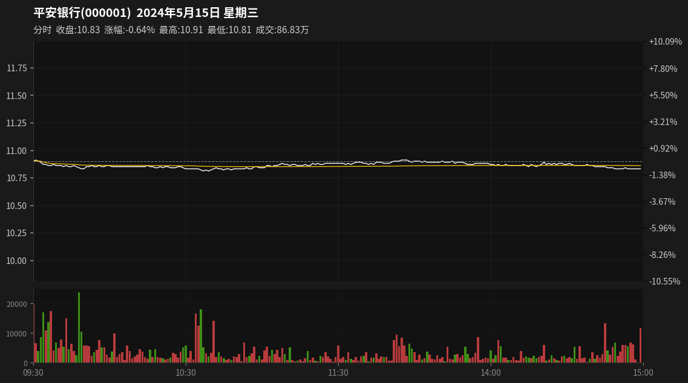
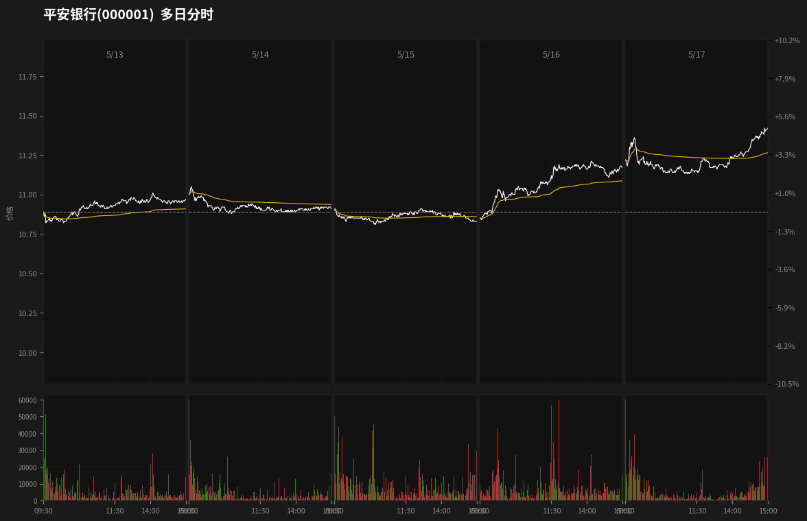

# Fenshitu MCP

A 股股票分时图生成 MCP（Model Context Protocol）服务。生成符合中国主流炒股软件（东方财富、同花顺）风格的专业股票图表。

## 功能特性

- **单日分时图**：完整交易日图表，包含价格线、均价线、成交量柱
- **多日分时图**：最多连续 7 个交易日，统一价格刻度
- **专业样式**：深色主题、双 Y 轴（价格 + 涨跌幅百分比）、红涨绿跌成交量柱
- **交易时间**：正确处理 A 股交易时间（09:30-11:30, 13:00-15:00），午休时段压缩显示
- **数据源**：mootdx（通达信行情数据）
- **系统服务**：支持 systemd 开机自启

## 截图展示

### 单日分时图



### 7 日多日分时图



## 安装

### 环境要求

- Python 3.10+
- Linux 系统（用于 systemd 服务）

### 快速安装

```bash
git clone https://github.com/hopkdj/fenshitu-mcp.git
cd fenshitu-mcp
python3 -m venv .venv
source .venv/bin/activate
pip install -r requirements.txt
```

## 使用方法

### MCP 集成

在 MCP 客户端配置中添加：

```json
{
  "mcpServers": {
    "fenshitu-mcp": {
      "command": "/path/to/fenshitu-mcp/.venv/bin/python",
      "args": ["-m", "fenshitu.server"],
      "cwd": "/path/to/fenshitu-mcp"
    }
  }
}
```

### 可用工具

#### `generate_intraday_chart`

生成单日分时图。

**参数：**
- `code`（必填）：股票代码，如 `"000001"`、`"600379"`
- `date`（可选）：交易日期，格式 `YYYYMMDD`，默认为当天
- `output_path`（可选）：输出文件路径

**示例：**
```json
{
  "tool": "generate_intraday_chart",
  "arguments": {
    "code": "000001",
    "date": "20240515"
  }
}
```

#### `generate_multi_day_chart`

生成多日分时图（最多 7 天）。

**参数：**
- `code`（必填）：股票代码
- `start_date`（必填）：开始日期，格式 `YYYYMMDD`
- `end_date`（可选）：结束日期，格式 `YYYYMMDD`，默认为 `start_date`
- `output_path`（可选）：输出文件路径

**示例：**
```json
{
  "tool": "generate_multi_day_chart",
  "arguments": {
    "code": "000001",
    "start_date": "20240513",
    "end_date": "20240517"
  }
}
```

### HTTP 模式（独立服务）

作为 HTTP 服务运行：

```bash
export MCP_TRANSPORT=http
export MCP_HOST=0.0.0.0
export MCP_PORT=8090
python -m fenshitu.server
```

### Systemd 服务

服务已配置为开机自启：

```bash
# 启用并启动
sudo systemctl enable fenshitu-mcp.service
sudo systemctl start fenshitu-mcp.service

# 查看状态
systemctl status fenshitu-mcp.service

# 查看日志
journalctl -u fenshitu-mcp.service -f
```

## 图表特性

### 单日分时图
- 白色价格线 + 黄色均价线（VWAP）
- 红涨绿跌成交量柱（A 股惯例：红涨绿跌）
- 双 Y 轴：左侧（价格），右侧（涨跌幅百分比）
- 时间标签：09:30, 10:30, 11:30, 14:00, 15:00
- 标题显示股票名称、代码、日期、星期
- 信息栏：收盘价、涨跌幅、最高价、最低价、成交量
- Y 轴范围固定为 ±10%（主板）或 ±20%（创业板/科创板），0% 居中

### 多日分时图
- 5 个交易日横向排列
- 统一价格刻度，便于对比
- 每日价格图 + 成交量图
- 时间标签：09:30, 11:30, 14:00, 15:00
- 午休时段（11:30-13:00）压缩显示，无空白
- 第一日 0 轴居中，所有日期共享同一参考线
- Y 轴范围以多日最高价为准，上下对称

## 项目结构

```
fenshitu-mcp/
├── src/fenshitu/
│   ├── server.py           # MCP 服务入口
│   ├── data_fetcher.py     # 数据获取（mootdx）
│   ├── chart_1day.py       # 单日分时图生成器
│   ├── chart_7day.py       # 多日分时图生成器
│   ├── indicators.py       # 技术指标（均价线）
│   └── styles.py           # 样式常量
├── pyproject.toml
├── requirements.txt
├── MCP_INTEGRATION.md      # 详细集成文档
├── README.md               # 英文说明
└── README_CN.md            # 中文说明
```

## 依赖

- `mcp>=1.20.0`：MCP SDK
- `mootdx>=0.11.0`：行情数据源
- `matplotlib>=3.8.0`：图表渲染
- `pandas>=2.0.0`：数据处理
- `numpy>=1.24.0`：数值计算

## 许可证

MIT
